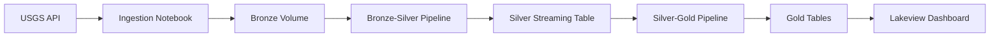

---

# 🌍 Earthquake Data Pipeline Project

A complete end-to-end data engineering solution for ingesting, processing, transforming, and visualizing real-time earthquake data from the USGS Earthquake API using Databricks Lakeflow.

## 📋 Project Overview

This project implements a **Medallion Architecture (Bronze → Silver → Gold)** pipeline that:

* Ingests earthquake data from the USGS Earthquake API into a Unity Catalog volume
* Processes and cleanses the data using Lakeflow Spark Declarative Pipelines
* Maintains a deduplicated, SCD Type 1 streaming Silver table
* Creates business-ready Gold aggregate tables for analytics
* Visualizes earthquake activity through an interactive dashboard

---

# 🏗️ Architecture

**Implemented a three-layer Medallion Architecture using Bronze, Silver, and Gold layers.**

* **Bronze Layer**

  * Raw JSON earthquake data stored in Unity Catalog volume
  * `/Volumes/{catalog}/bronze/earthquake_data`

* **Silver Layer**

  * Cleaned, typed, validated, and deduplicated streaming table
  * `earthquake_data_final_silver`

* **Gold Layer**

  * Business-ready aggregated tables for reporting and dashboarding
  * Examples:

    * `earthquake_summary`
    * `earthquake_daily`
    * `magnitude_distribution`
    * `status_summary`
    * `top_locations`
    * `tsunami_summary`


---


## 📊 Components

### 1. Ingestion Notebook (`ingestion_bronze.ipynb`)

* Fetches earthquake data from USGS API
* Writes raw JSON files to Unity Catalog volume
* Configurable catalog parameter


---

### 2. Bronze → Silver Pipeline (`bronze_silver_earthquake_etl`)

* Auto Loader ingests JSON files
* Parses nested JSON
* Extracts earthquake properties
* Cleans and casts columns
* Creates temporary streaming view
* Uses Auto CDC (SCD Type 1)
* Produces:


```
earthquake_data_final_silver
```

---

### 3. Silver → Gold Pipeline (`silver_gold_earthquake_etl`)

Creates analytical tables from the Silver layer.

Generated Gold tables:

* earthquake_summary
* earthquake_daily
* magnitude_distribution
* status_summary
* top_locations
* tsunami_summary

These tables are optimized for dashboards and business reporting.


---

### 4. Dashboard (`Earthquake Analysis Dashboard`)

Visualizes earthquake metrics using the Gold Layer.
https://dbc-a21855d2-df58.cloud.databricks.com/dashboardsv3/01f17f942dbb1cb88198a0cc2cd7abc8/published?o=7474651308033798


Dashboard includes:

* Overall earthquake summary
* Daily earthquake trends
* Magnitude distribution
* Top earthquake locations
* Tsunami statistics
* Status distribution

Connected to the Gold tables.


---

### 5. End-to-End Job (`Data1_Earthquake_End_End_Job`)

Orchestrates the complete workflow:

1. Data Ingestion (Bronze)
2. Bronze → Silver Pipeline
3. Silver → Gold Pipeline
4. Dashboard Refresh


---

## 📁 Project Structure

```text
Data1_Earthquake_Project_bundle/
├── databricks.yml
├── README.md
├── resources/
│   ├── bronze_silver_earthquake_etl.pipeline.yml
│   ├── silver_gold_pipeline.yml
│   ├── earthquake_dashboard.yml
│   └── earthquake_end_end.job.yml
└── src/
    ├── notebook/
    │   └── ingestion_bronze.ipynb
    ├── DLT_Pipelines/
    │   ├── Bronze_Silver_Earthquake1/
    │   │   └── transformations/
    │   │       └── cleaned_earthquake_data.py
    │   └── Silver_Gold_Earthquake/
    │       └── transformations/
    │           └── my_transformation.py
    └── Dashboard/
        └── Earthquake Analysis Dashboard.lvdash.json
```

---

## 🔄 Data Flow



---

## 📝 Data Schema

### Silver Table

`earthquake_data_final_silver`

Fields:

* id
* mag
* place
* time
* latitude
* longitude
* depth
* tsunami
* status
* type
* alert
* magType
* _load_timestamp

---

### Gold Tables

| Table                  | Description                      |
| ---------------------- | -------------------------------- |
| earthquake_summary     | Overall earthquake KPIs          |
| earthquake_daily       | Daily earthquake counts          |
| magnitude_distribution | Magnitude-wise distribution      |
| status_summary         | Earthquake status summary        |
| top_locations          | Most active earthquake locations |
| tsunami_summary        | Tsunami event statistics         |

---

## 🚀 Deployment

```bash
databricks bundle deploy --target dev

databricks bundle run Data1_Earthquake_End_End_Job --target dev
```

---

## 🛠️ Pipeline Features

* Auto Loader
* Auto CDC (SCD Type 1)
* Bronze → Silver → Gold Medallion Architecture
* Streaming Processing
* Serverless Compute
* Photon Optimization
* Lakeview Dashboard
* Unity Catalog Integration

---

## 📈 Monitoring

* Bronze-Silver Pipeline Monitoring
* Silver-Gold Pipeline Monitoring
* Job Runs
* Event Logs
* Dashboard Metrics
* Unity Catalog Lineage

---

