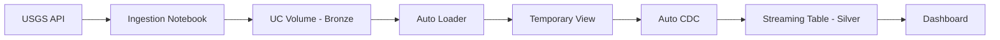

# 🌍 Earthquake Data Pipeline Project

A complete end-to-end data engineering solution for ingesting, processing, and visualizing real-time earthquake data from the USGS Earthquake API using Databricks Lakeflow.

## 📋 Project Overview

This project implements a medallion architecture (Bronze → Silver) pipeline that:
* Ingests earthquake data from the USGS Earthquake API into a Unity Catalog volume
* Processes and cleanses the data using Lakeflow Spark Declarative Pipelines
* Maintains a deduplicated, SCD Type 1 streaming table
* Visualizes earthquake activity through an interactive dashboard

## 🏗️ Architecture

**Implemented a two-layer Medallion Architecture using Bronze and Silver layers.:**
* **Bronze Layer**: Raw JSON earthquake data stored in Unity Catalog volume (`/Volumes/{catalog}/bronze/earthquake_data`)
* **Silver Layer**: Cleaned, typed, and deduplicated streaming table (`earthquake_data_final`)

**Technology Stack:**
* **Databricks Lakeflow**: Orchestration and workflow management
* **Spark Declarative Pipelines**: ETL transformations with Auto Loader and Auto CDC
* **Unity Catalog**: Data governance and storage
* **Lakeview Dashboard**: Data visualization

## 📊 Components

### 1. **Ingestion Notebook** (`ingestion_bronze.ipynb`)
* Fetches earthquake data from USGS API
* Writes raw JSON files to Unity Catalog volume
* Configurable catalog parameter


  

### 2. **Pipeline** (`bronze_silver_earthquake_etl`)
* **Auto Loader**: Incrementally ingests JSON files from volume
* **Temporary View** (`earthquake_data_vw`): Parses nested JSON structure, explodes features array, extracts properties and geometry
* **Streaming Table** (`earthquake_data_final`): Deduplicates by `id` using SCD Type 1 CDC pattern
* 
  

### 3. **Dashboard** (`Data1_Earthquake_Dashboard`)
* Visualizes earthquake metrics and trends
* Connected to Silver layer table
* 


### 4. **End-to-End Job** (`Data1_Earthquake_End_End_Job`)
* Orchestrates the complete workflow:
  1. Data ingestion (Bronze)
  2. Pipeline transformation (Silver)
  3. Dashboard refresh
  
  


## 📁 Project Structure

```
Data1_Earthquake_Project_bundle/
├── databricks.yml                 # Bundle configuration
├── README.md                      # This file
├── resources/                     # Resource definitions
│   ├── bronze_silver_earthquake_etl.pipeline.yml
│   ├── earthquake_end_end.job.yml
│   └── earthquake_dashboard.yml
└── src/
    ├── notebook/
    │   └── ingestion_bronze.ipynb           # Data ingestion
    ├── DLT_Pipelines/Bronze_Silver_Earthquake1/
    │   └── transformations/
    │       └── cleaned_earthquake_data.py   # Pipeline transformation logic
    └── Dashboard/
        └── Data1_Earthquake_Dashboard.lvdash.json
```

## 🔄 Data Flow



## 📝 Data Schema

**Silver Table Fields:**
* `id` (primary key): Unique earthquake identifier
* `mag`: Magnitude (double)
* `place`: Location description
* `time`: Earthquake timestamp
* `latitude`, `longitude`, `depth`: Geographic coordinates
* `tsunami`: Tsunami indicator
* `status`, `type`, `alert`, `magType`: Event metadata
* `_load_timestamp`: Ingestion timestamp

## 🚀 Getting Started

### Prerequisites
* Databricks workspace with Unity Catalog enabled
* Serverless compute enabled
* SQL Warehouse for dashboard queries

### Deployment

#### Option 1: UI Deployment
1. Open the **Deployments** panel (🚀 icon in left sidebar)
2. Click **Deploy**
3. Run the deployed job from the Deployments panel

#### Option 2: CLI Deployment
```bash
databricks bundle deploy --target dev
databricks bundle run Data1_Earthquake_End_End_Job --target dev
```

### Targets

**Dev Target** (default):
* Catalog: `data1_earthquake_dev`
* Schema: `dev` / `silver`
* Mode: Development (resources prefixed with `[dev username]`)

**Prod Target**:
* Catalog: `data1_earthquake_prod`
* Schema: `prod` / `silver`
* Mode: Production
* Path: `/Workspace/PROD_Data1_Earthquake_Project`

## 🔧 Configuration

Key variables (defined in `databricks.yml`):
* `catalog`: Target Unity Catalog catalog
* `schema`: Target schema for dashboard
* `warehouse_id`: SQL Warehouse for queries

## 🛠️ Pipeline Features

* **Auto Loader**: Incremental, scalable file ingestion with schema inference
* **Auto CDC**: Change Data Capture with SCD Type 1 (keeps latest record per ID)
* **Serverless**: No cluster management required
* **Photon**: Accelerated query execution
* **Continuous**: Can be configured for streaming or triggered mode

## 📈 Monitoring

* Pipeline updates and lineage: Pipeline monitoring page
* Job runs: Jobs UI
* Data quality: Pipeline expectations and event logs
* Dashboard metrics: Lakeview dashboard


## 👤 Author

Usama Patel (usamapatel340@gmail.com)


This README provides a complete overview of your earthquake data pipeline project. Would you like me to update the actual README.md file in your bundle with this content?
